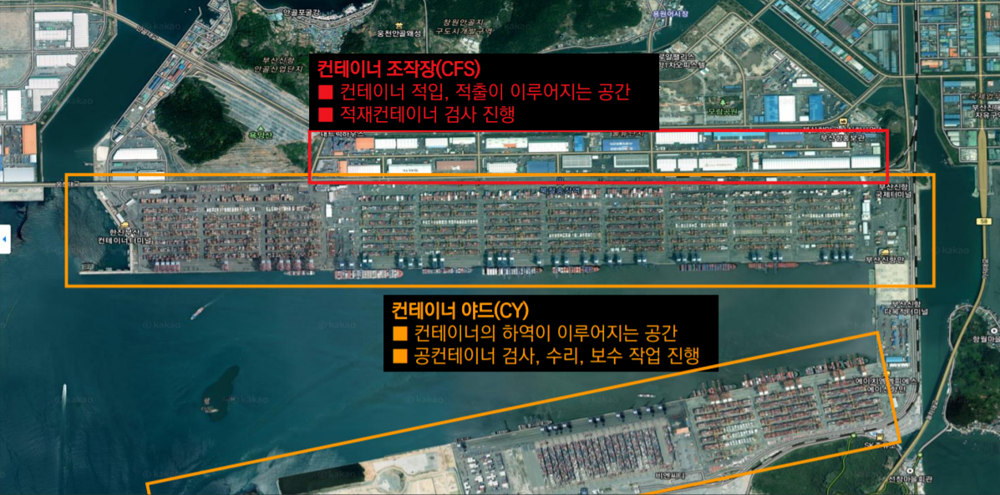

# Container 파손 분류 프로젝트

## 프로젝트 소개

목적은 파손 컨테이너 데이터 세트를 구축하고, 컨테이너 파손을 구분하는 이미지 분석 AI 모델을 개발하는 것입니다.

이때 기대효과는 컨테이너 파손 여부 자동 판별을 통한 효율적인 컨테이너 보수·수리 프로세스 수립 기여, 공급사슬 내 지점별 컨테이너 파손 여부 파악을 통한 물류 가시성 확보입니다.

그림 1 - 항만의 구조 - [컨테이너 조작장(CFS), 컨테이너 야드(CY)] 

컨테이너는 다양한 원인으로 파손되고 있습니다.

그림 2 - 컨테이너 파손원인 

## 데이터 수집·증가·전처리

### 데이터 수집
**수집 데이터 : 정상 및 파손 컨테이너 이미지**
(주요 검색어: container, damaged container, cargo, container accident 등)

**방법 :** 크롤링 코드 작성 후, 각 검색 플랫폼의 html 태그를 확인·수정하여 스크래핑을 수행
보안 문제로 스크래핑이 불가능한 경우, 직접 다운로드하여 이미지 데이터 수집

중복된 사진 제외 576장 수집(정상 299장, 파손 277장)

### 배경제거작업(Cropping)

인식하고자 하는 객체를 배경으로부터 분리하고, 컨테이너 객체를 명확히 하여 알고리즘에게
학습시키기 위하여 객체 주변의 배경을 제거하는 작업

그림 3 - 포토샵을 활용한 배경제거 예시 

### 현장촬영

부족한 사진 데이터의 추가적인 확보를 위한 CFS 내 장치된 컨테이너 사진 촬영을 진행 하였다.

**방문장소 : DW국제물류센터**(운영팀 이정한 과장), **부산크로스독**(창고관리팀 신태용 부장)

정상 컨테이너 사진 약 580여 장 촬영후 데이터 추가완료

### 데이터 증가작업

파손된 컨테이너 이미지가 부족하여 Keras의 ImageDataGenerator을 사용하여 데이터 증가작업을 실행하였다.

그림 4 - 데이터 증가작업 예시

### 데이터 전처리

그림 5 - 데이터 전처리 과정

# 알고리즘 적용 결과

## 머신러닝

그림 6 - 머신러닝 수행 결과

머신러닝 방법이 이미지 데이터에 적용하기 어렵다고 판단 따라서, 이미지 데이터 분류에 적합한 딥러닝 알고리즘을 수행 

## 딥러닝

딥러닝은 **CNN**(Convolution Neural Network)와 **전이학습** 을 사용하여 시행하였다.

### CNN 

그림 7 - 딥러닝 수행 결과
 
모델을 다양하게 설정해 가며 수행하여 보았고 [7]과 같은 결과를 얻을수있었는데 loss가 높게 나왔다.

### 전이학습
**AlexNet**

그림 8 - AlexNet 훈련 과정 그래프(Loss 기준)

tensorflow에서 load_model을 활용하여 저장된 최선의 값을 불러왔을때 loss=0.2468, accuracy=0.9334 로 CNN보다 좋은 성능을 보여주었다.

**VGG-16**

그림 9 - VGG-16 훈련 과정 그래프(Loss 기준)

tensorflow에서 load_model을 활용하여 저장된 최선의 값을 불러왔을때 loss=0.0257, accuracy=0.9933 로 가장 좋은 좋은 성능을 보여주었다.

## CNN·전이학습 수행 결과 종합

그림 10 - CNN·전이학습 수행 결과 종합

# Link

[1] [프로젝트 코드](https://drive.google.com/drive/folders/1TDt6PFW884Yg8vTDhbJJ9s7PfFcuKQKg?usp=sharing)

[2] https://arxiv.org/abs/1409.1556
